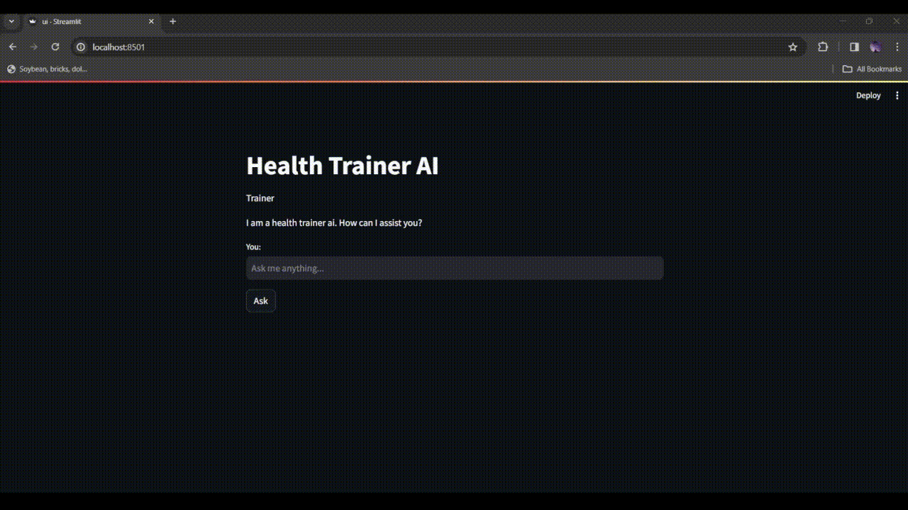

# Health Trainer AI

It is a Health Trainer AI. It gives advices related to health.

## Demo

See how the tool works:




## How to run the tool


### Run with Docker

1. Create `.env` file in the root directory of the project, copy and paste the below config. Replace the `OPENAI_API_TOKEN` configuration value with your key `{OPENAI_API_KEY}` and replace `LOCAL_FOLDER_PATH` with a path where Data folder is located `{REPLACE_WITH_FOLDER_PATH}`.

```bash
OPENAI_API_TOKEN={OPENAI_API_KEY}
EMBEDDER_LOCATOR=text-embedding-ada-002
EMBEDDING_DIMENSION=1536
MODEL_LOCATOR=gpt-3.5-turbo
MAX_TOKENS=200
TEMPERATURE=0.0
LOCAL_FOLDER_PATH={REPLACE_WITH_RELATIVE_PATH}
```

2. From the project root folder, open your terminal and run `docker compose up`.
3. Navigate to `localhost:8501` on your browser when docker installion is successful.

